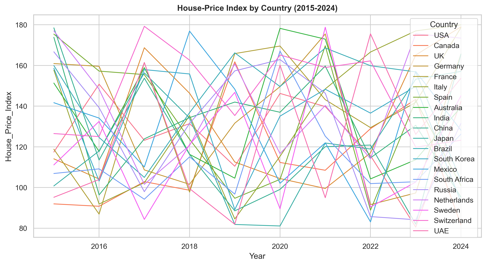
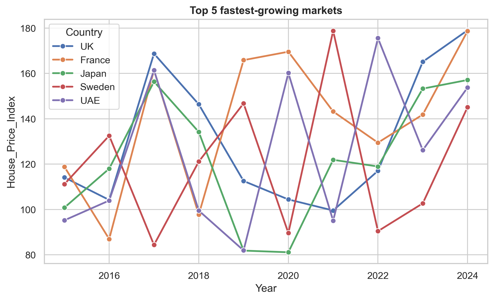
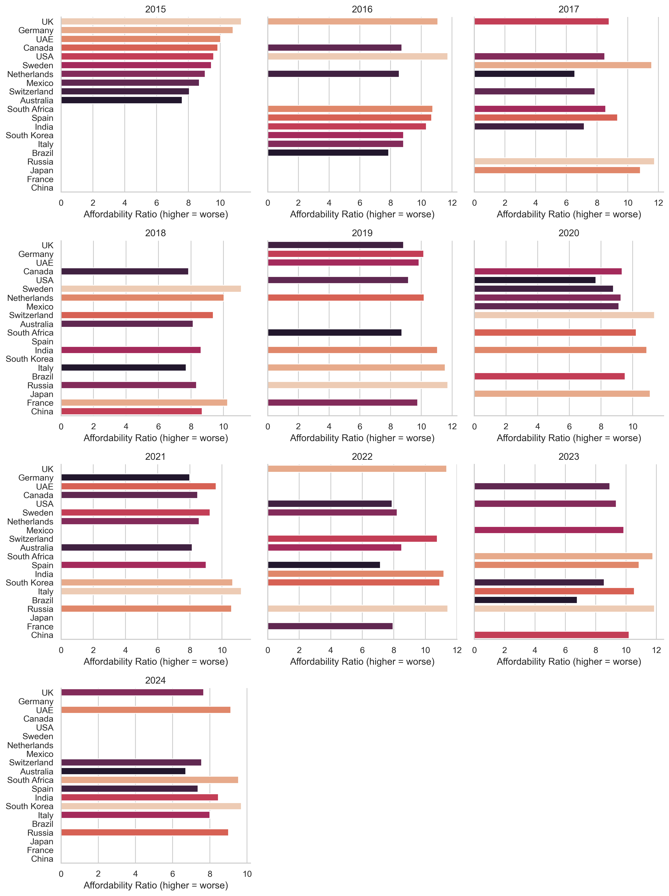
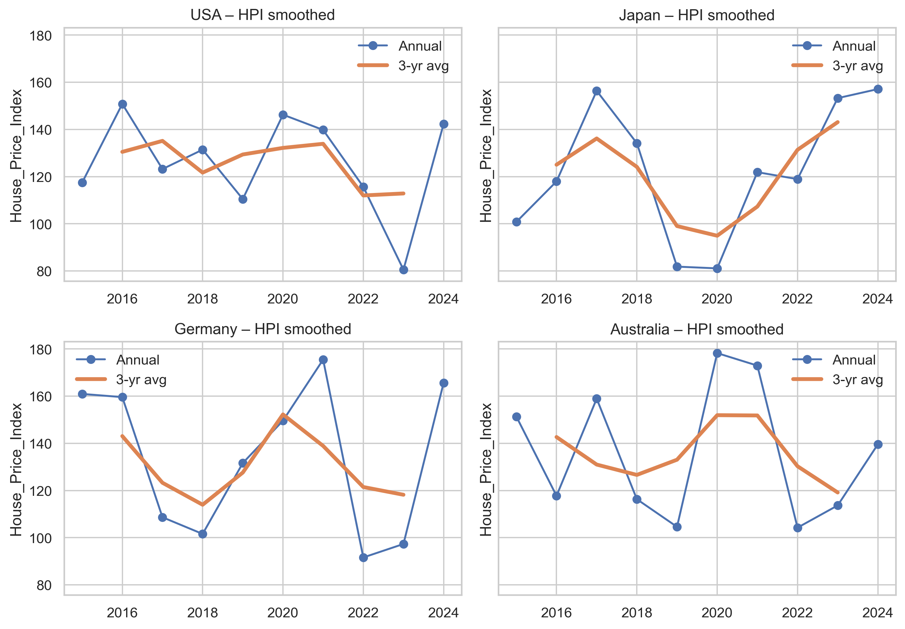
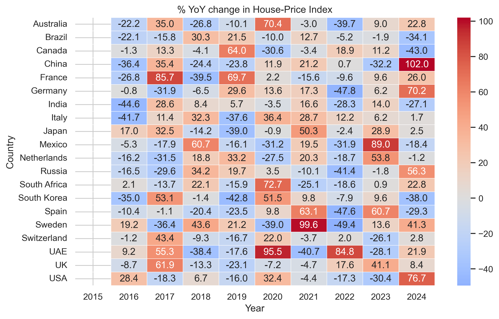
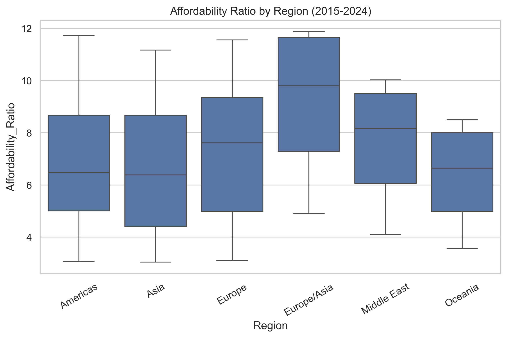
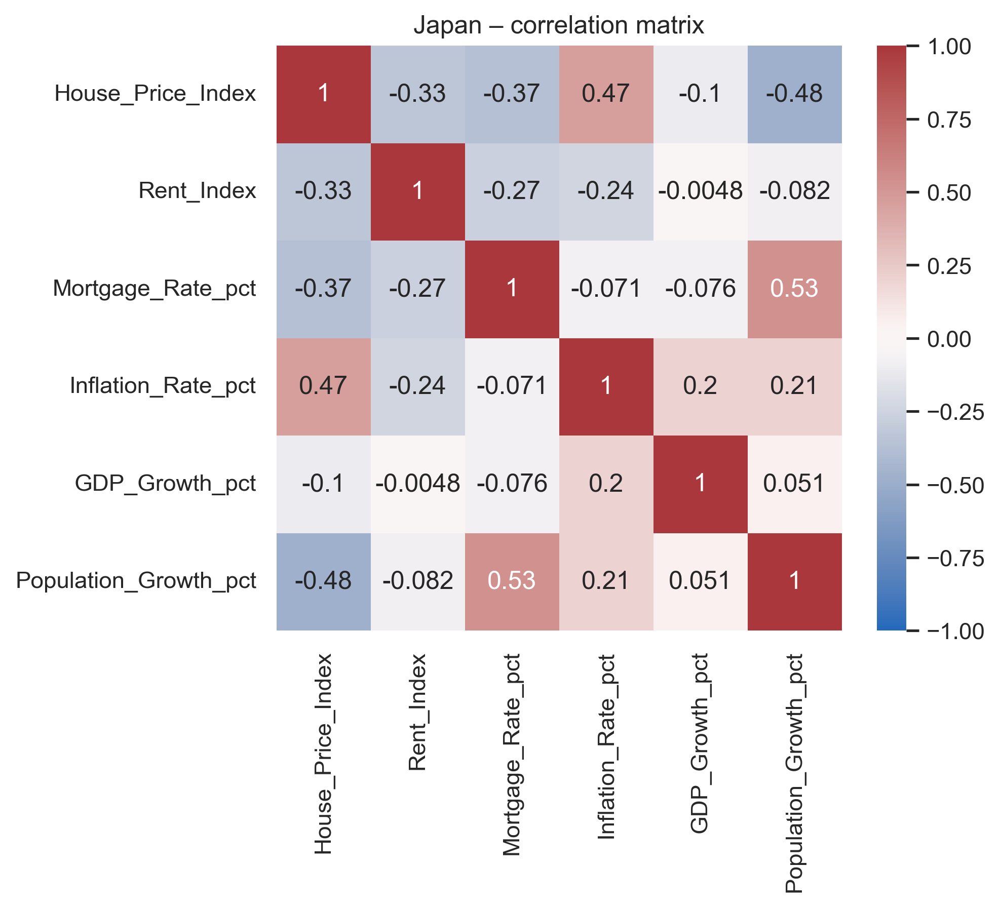

# Housing‑Viz

Light‑weight helper module (`housing_viz.py`) plus example notebooks / scripts
for exploring the **Kaggle Global Housing Market Analysis 2015 – 2024** dataset.

---

## Quick‑start

```bash
git clone https://github.com/<your‑username>/housing‑viz.git
cd housing-viz
python -m venv .venv && source .venv/bin/activate   # Windows: .venv\Scripts\activate
pip install -r requirements.txt
python driver_generate_figs.py                      # or open demo.ipynb
```

> **Prerequisite:** place your `kaggle.json` API key in `~/.kaggle/`  
> (see the [Kaggle docs](https://www.kaggle.com/docs/api) for details).

The first run downloads a tiny (18 kB) CSV with 200 rows and caches it in
`~/.cache/kagglehub`. Subsequent runs are instant.

---

## Generated visualisations

The driver script writes all PNGs to **`figs/`** so the repo ships with the
exact same images you see below.

### 1. House‑Price Index — all countries


### 2. Top‑5 fastest‑growing markets (2015 → 2024)


### 3. Affordability ratio — worst 10 each year


### 4. Smoothed HPI for four major economies


### 5. YoY change heat‑map


### 6. Affordability by region


### 7. Correlation matrix (Japan example)


### 8. Interactive affordability “race”
The driver launches an HTML/Plotly slider (not embedded here); you can also
export it:

```python
fig = hv.plotly_affordability_slider(df)
fig.write_html("figs/affordability_slider.html")
```

---

## One‑line interpretations

| Visual | Insight |
|--------|---------|
| **Spaghetti HPI** | India & UAE push past 175 by 2024, while China/Brazil stay < 120. |
| **Top‑5 growth** | UK edges out France in 2024; Sweden rebounds after 2021 slump. |
| **Affordability** | Germany & UK consistently least‑affordable; India & China most affordable. |
| **Smoothed HPI** | Japan shows strong post‑2021 recovery; Germany follows a W‑shape. |
| **YoY heat‑map** | France 2016 and Russia 2024 spike > 70 % YoY. |
| **Region box‑plot** | Europe/Asia median affordability ≈ 10 vs Americas ≈ 6. |
| **Correlation** | In Japan, HPI positively tracks inflation (+0.47) and inversely tracks population growth (−0.48). |

---

## Folder layout

```
housing-viz/
│
├─ housing_viz.py          # helper library
├─ driver_generate_figs.py # recreates all PNGs in figs/
├─ demo.ipynb              # interactive tour (optional)
├─ figs/                   # pre‑generated images
├─ requirements.txt
└─ README.md
```

---

## License

MIT – use, fork, and enjoy!
